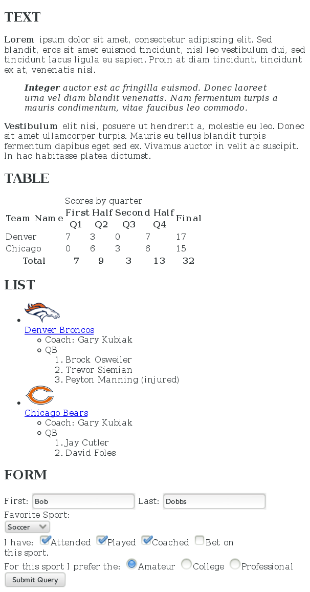

# HTML Assessment

### Description
This is a basic mockup that was followed from an example. The main goal of this project was to put together an HTML webpage that looked just the example that was provided.

The last pushes to this project added some CSS styling with the HTML. The stylesheet is connected with CSSAssessment.html, which has some id and class tags added for styling.

### Technologies Used
- Atom
- Git
- HTML

### What I learned
This is not my first time using HTML, I am pretty familiar with it. But I have never really needed to use a table for the projects I was working on. This project taught me how to make a table in html with a caption and table headers for titling. This also got some extra work in using several variations of form inputs and creating labels for the inputs.

The css assessment taught me how to select elements inside of another element with (element > element) and some nice practice with using the pseudo  commands such as ":first-child, :last-child, nth-child(), ::before, and ::after". I was familiar with some of these pseudo commands, but never really put them into practice. Practicing these helped get a better understanding of when and how to use pseudo commands to select specific elements for styling.

### Example

